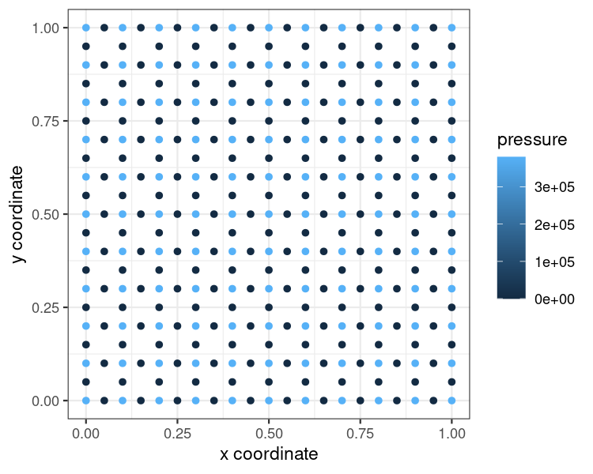

```r
library(r2ogs6)
library(ggplot2)
```

## Prerequisites

This guide assumes you have `r2ogs6` and its dependencies installed. If that's not the case, please take a look at the installation instructions provided in the `README.md` file of the repository.

After loading `r2ogs6`, we first need to set the package options so it knows where to look for OpenGeoSys 6.


```r
# Set path for OpenGeoSys 6
options("r2ogs6.default_ogs6_bin_path" = "your_ogs6_bin_path")
```

## Creating your simulation object
To represent a simulation object, `r2ogs6` uses an `R6` class called `OGS6`. If you're new to `R6` objects, don't worry. Creating a simulation object is easy. We call the class constructor and provide it with some parameters:

* `sim_name` The name of your simulation

* `sim_path` All relevant files for your simulation will be in here


```r
# Change this to fit your system
# sim_path <- system.file("extdata/benchmarks/flow_no_strain",
#                         package = "r2ogs6")
sim_path <- tempdir()
ogs6_obj <- OGS6$new(sim_name = "my_simulation",
                     sim_path = sim_path)
```

And that's it, we now have a simulation object.


## Defining the simulation parameters

From here on there's two ways you can define the simulation parameters. Either you load a benchmark file or you define your simulation manually.

### Loading a benchmark file

The quickest and easiest way to define a simulation is by using an already existing benchmark. If you take a look at the [OpenGeoSys documentation](https://www.opengeosys.org/docs/benchmarks/elliptic/elliptic-dirichlet/), you'll find plenty of benchmarks to choose from along with a link to their project file on GitLab at the top of the respective page.

For demonstration purposes, I will use a project from the `HydroMechanics` benchmarks, which can be found [here](https://gitlab.opengeosys.org/ogs/ogs/-/tree/master/Tests/Data/HydroMechanics/IdealGas/flow_no_strain).


```r
# Change this to fit your system
#prj_path <- paste0(sim_path, "/flow_no_strain.prj")
prj_path <- system.file("extdata/benchmarks/flow_no_strain/flow_no_strain.prj",
                       package = "r2ogs6")
read_in_prj(ogs6_obj, prj_path = prj_path, read_in_gml = T)
```


NOTE: `r2ogs6` has not been tested with every existing benchmark. Due to the large number of input parameters, you might encounter cases where the import fails.


### Setting up your own OpenGeoSys 6 simulation
Setting up your own simulation is possible too.

Since there's plenty of required and optional input parameters, you might want to call `get_status()` occasionally to get a brief overview of your simulation. This tells you which input parameters are missing before you can run a simulation.


```r
# Call on the OGS6 object (note the R6 style)
ogs6_obj$get_status()
#> ✓ 'processes' has at least one element
#> ✓ 'time_loop' is defined
#> ✓ 'nonlinear_solvers' has at least one element
#> ✓ 'linear_solvers' has at least one element
#> ✓ 'parameters' has at least one element
#> ✓ 'process_variables' has at least one element
#> ✗ 'mesh' is defined
#> ✗ 'geometry' is defined
#> ✓ 'media' has at least one element
#> ✗ 'test_definition' has at least one element
#> ✗ 'curves' has at least one element
#> ✓ 'meshes' has at least one element
#> ✗ 'local_coordinate_system' is defined
#> ✗ 'search_length_algorithm' is defined
#> ✗ 'chemical_system' is defined
#> ✗ 'python_script' is defined
#> ✗ 'insitu' is definedYour OGS6 object has all necessary components.
#> You can try calling ogs6_run_simulation().Note that this calls more validation functions, so you may not be done just yet.
```

Since we haven't defined anything so far, you'll see a lot of red there. But the results gave us a hint what we can add. We'll go from there and try to find out more about the possible input data. Say we want to find out more about `process` objects.


```r
# To take a look at the documentation, use ? followed by the name of a class
?prj_process
```

As a rule of thumb, classes are named with the prefix `prj_` followed by their XML tag name in the `.prj` file. The only exceptions to this rule are subclasses where this would lead to duplicate class names. The class `prj_time_loop` for example contains a subclass representing a `process` child element which is not to be confused with the `process` children of the first level `processes` node directly under the root node of the `.prj` file. Because of this, that subclass is named `prj_tl_process`. Let's try adding something now.

To add data to our simulation object, we use `OGS6$add()`. We can use this method with any top level `.prj` element, which means we're not limited to `prj_parameter` objects.


```r
# Add a parameter
ogs6_obj$add(prj_parameter(name = "E",
                           type = "Constant",
                           value = 1e+10))


# Add a process variable
ogs6_obj$add(
    prj_process_variable(
        name = "pressure",
        components = 1,
        order = 1,
        initial_condition = "pressure0",
        boundary_conditions = list(
            boundary_condition = prj_boundary_condition(
                type = "Neumann",
                parameter = "flux_in",
                geometrical_set = "cube_1x1x1_geometry",
                geometry = "left",
                component = 0
            )
        )
    )
)
```

Since I already read in a `.prj` file earlier, I won't run the above snippet. If you'd like a complete example of manually defining simulation parameters, there's a script `flow_free_expansion.R` in the `examples/workflow_demos` folder.

## Running the simulation

As soon as we've added all necessary parameters, we can try starting our simulation. This will run a few additional checks and then start OpenGeoSys 6. If `write_logfile` is set to `FALSE`, the output from OpenGeoSys 6 will be shown on the console.


```r

ogs6_run_simulation(ogs6_obj)
```

## Retrieve the results
After our simulation is finished, we might want to plot some results. But how do we retrieve them? If all went as expected, we don't need to call an extra function for that because `ogs6_run_simulation()` already calls `ogs6_read_output_files()` internally. We only need to decide what information we want to extract. Say we're interested in the `pressure` Parameter from the last timestep. For this easy example, only one `.pvd` file was produced.


```r
ogs6_read_output_files(ogs6_obj)
```


```r
# Extract relevant info into dataframe
result_df <- ogs6_obj$pvds[[1]]$get_point_data(keys = c("pressure"))
result_df <- result_df[(result_df$timestep!=0),]

# Plot results
ggplot(result_df,
       aes(x = x,
           y = y,
           color = pressure)) +
    geom_point() +
    #geom_raster(interpolate = T)+
    #geom_contour_filled()+
    xlab("x coordinate") +
    ylab("y coordinate") +
    theme_bw()
```




Similar to the idea with `.pvd` output, `hdf5` files are automatically referenced under `$h5s` if returned by the simulation. Here, we have added a file artificially from the benchmark library for demonstration.


```r
ogs6_obj$h5s
#> [[1]]
#> OGS6_h5
#> h5 path:
#> /work/ufz/r2ogs6/inst/extdata/benchmarks/EllipticPETSc/cube_1e3_np3.h5 
#> 
#> # h5 file structure ------------------------------------------------------ 
#>    group                   name       otype  dclass      dim
#> 0      /                    t_0   H5I_GROUP                 
#> 1   /t_0 D1_left_front_N1_right H5I_DATASET   FLOAT     1895
#> 2   /t_0     Linear_1_to_minus1 H5I_DATASET   FLOAT     1895
#> 3   /t_0            MaterialIDs H5I_DATASET INTEGER     1233
#> 4   /t_0               geometry H5I_DATASET   FLOAT 3 x 1895
#> 5   /t_0               pressure H5I_DATASET   FLOAT     1895
#> 6   /t_0               topology H5I_DATASET INTEGER    11097
#> 7   /t_0                      v H5I_DATASET   FLOAT 3 x 1895
#> 8      /                    t_1   H5I_GROUP                 
#> 9   /t_1               pressure H5I_DATASET   FLOAT     1895
#> 10  /t_1                      v H5I_DATASET   FLOAT 3 x 1895
```
As can be seen, hdf5 files have a very particular structure. To work with the data, a simple method `get_h5()` allows to access the different data elements as a very raw starting point for post processing the data.


```r
h5_list <- ogs6_obj$h5s[[1]]$get_h5("/")
```

Other functions such as HDF5 handles for dataset processing can be used directly from the *rhdf5* package, of course. The path to the hd5 file is available as an active field `h5_path` that can be accessed or changed in the *OGS6* object.

```r
example_h5 <- rhdf5::H5Fopen(ogs6_obj$h5s[[1]]$h5_path)
example_h5
#> HDF5 FILE 
#>         name /
#>     filename 
#> 
#>   name     otype dclass dim
#> 0  t_0 H5I_GROUP           
#> 1  t_1 H5I_GROUP
str(example_h5$t_0)
#> List of 7
#>  $ D1_left_front_N1_right: num [1:1895(1d)] 1 1 1 1 1.01 ...
#>  $ Linear_1_to_minus1    : num [1:1895(1d)] 1 0.8 0.6 1 0.8 0.6 1 0.8 0.6 1 ...
#>  $ MaterialIDs           : int [1:1233(1d)] 0 0 0 0 0 0 0 0 0 0 ...
#>  $ geometry              : num [1:3, 1:1895] 0 0 0 0.1 0 0 0.2 0 0 0 ...
#>  $ pressure              : num [1:1895(1d)] 0 0 0 0 0 0 0 0 0 0 ...
#>  $ topology              : int [1:11097(1d)] 9 0 1 4 3 49 50 53 52 9 ...
#>  $ v                     : num [1:3, 1:1895] 0 0 0 0 0 0 0 0 0 0 ...
rhdf5::h5closeAll()
```


If the file has a reasonably "clean" structure, a more convenient way of importing the data is using the method `get_df` that returns a *tibble* table.


```r
df <- ogs6_obj$h5s[[1]]$get_df(group = "/t_0", names = "pressure")
df
#> # A tibble: 1,895 × 5
#>        x     y     z  time pressure
#>    <dbl> <dbl> <dbl> <dbl>    <dbl>
#>  1   0     0       0     0        0
#>  2   0.1   0       0     0        0
#>  3   0.2   0       0     0        0
#>  4   0     0.1     0     0        0
#>  5   0.1   0.1     0     0        0
#>  6   0.2   0.1     0     0        0
#>  7   0     0.2     0     0        0
#>  8   0.1   0.2     0     0        0
#>  9   0.2   0.2     0     0        0
#> 10   0     0.3     0     0        0
#> # … with 1,885 more rows
```


### Example Bechnmark with HDF5 output

Now this shows how to run a real example benchmark that outputs a hdf5 file.
Setup and run the benchmark.
```r
sim_path <- tempdir()
ogs6_obj2 <- OGS6$new("ex_hdf5", sim_path = sim_path)
bm <- "/home/boogjoha/work/r2ogs6/tmp/update_652/Data_652/Elliptic/square_1x1_SteadyStateDiffusion/square_1e2_GMRES_GML_output_xdmf-hdf5.prj"
read_in_prj(ogs6_obj2, bm)

dir_make_overwrite(ogs6_obj2$sim_path)
run_benchmark(prj_path = bm, sim_path = ogs6_obj2$sim_path)
```

Now read the h5df output.
```r
ogs6_read_output_files(ogs6_obj2)
h5_list <- ogs6_obj2$h5s[[1]]$get_h5("/")

h5_list
#> ogs6_obj2$h5s
# [[1]]
# OGS6_h5
# h5 path:
# /tmp/Rtmp4SkpPb/square_1x1_quad_1e2_GMRES_GML_output.h5 

# h5 file structure ---------------------------------------------------------------------------------------------- 
                              group                     name       otype
#0                                 /                   meshes   H5I_GROUP
#1                           /meshes square_1x1_geometry_left   H5I_GROUP
#2  /meshes/square_1x1_geometry_left                 geometry H5I_DATASET
#3  /meshes/square_1x1_geometry_left                 pressure H5I_DATASET
#4  /meshes/square_1x1_geometry_left                 topology H5I_DATASET
#5  /meshes/square_1x1_geometry_left                        v H5I_DATASET
#6                           /meshes      square_1x1_quad_1e2   H5I_GROUP
#7       /meshes/square_1x1_quad_1e2                 geometry H5I_DATASET
#8       /meshes/square_1x1_quad_1e2                 pressure H5I_DATASET
#9       /meshes/square_1x1_quad_1e2                 topology H5I_DATASET
#10      /meshes/square_1x1_quad_1e2                        v H5I_DATASET
#11                                /                    times H5I_DATASET
#    dclass         dim
#0                     
#1                     
#2    FLOAT  3 x 11 x 1
#3    FLOAT      11 x 2
#4  INTEGER      40 x 1
#5    FLOAT  2 x 11 x 2
#6                     
#7    FLOAT 3 x 121 x 1
#8    FLOAT     121 x 2
#9  INTEGER     500 x 1
#10   FLOAT 2 x 121 x 2
#11   FLOAT           2
```

## Running multiple simulations

If we want to run not one but multiple simulations, we can use the simulation object we just created as a blueprint for an ensemble run. The workflow for this is described in detail [here](ensemble_workflow_vignette.Rmd).


## Benchmark script generation

Another feature of `r2ogs6` is benchmark script generation. For this, there are
two functions.

- `ogs6_generate_benchmark_script()` creates an R script from a `.prj` file

- `ogs6_generate_benchmark_scripts()` is a wrapper for the former. Instead of a
single `.prj` file path, it takes a directory path as its argument.

Let's look at the parameters for `ogs6_generate_benchmark_script()` first. Say
we have a project file `sim_file.prj` we want to generate a script from.
Please, make sure that all the directories your are referencing exist.


```r
# The path to the project file you want to generate a script from
prj_path <- "your_path/sim_file.prj"

# The path you want to save the simulation files to
sim_path <- "your_sim_directory/"

# The path to your `ogs.exe` (if not already specified in `r2ogs6` options)
ogs6_bin_path <- "your_ogs6_bin_path/"

# The path you want your benchmark script to be saved to
script_path <- "your_script_directory/"
```

Now that we have defined our parameters, we can generate the benchmark script.


```r
ogs6_generate_benchmark_script(prj_path = prj_path,
                               sim_path = sim_path,
                               ogs6_bin_path = ogs6_bin_path,
                               script_path = script_path)
```

On the other hand, if we want to generate R scripts from multiple (or all)
benchmarks, we can use the wrapper function `ogs6_generate_benchmark_scripts()`.
Its parameters are basically the same, only this time we supply it with a
directory path instead of a `.prj` path to start from.

You can download the benchmarks (or the subfolder you need) from
[here](https://gitlab.opengeosys.org/ogs/ogs/-/tree/master/Tests/Data) and then
set `path` to their location on your system.


```r
# The path to the directory you want to generate R scripts from
path <- "path/to/ogs/Tests/Data/Elliptic/"

# The path you want to save the simulation files to
sim_path <- "your_sim_directory/"

# The path you want your benchmark scripts to be saved to
script_path <- sim_path

# Optional: Use if you want to start from a specific `.prj` file
starting_from_prj_path <- ""

# Optional: Use if you want to skip specific `.prj` files
skip_prj_paths <- character()

# Optional: Use if you want to skip specific `.prj` files
skip_prj_paths <- character()

# Optional: Use if you want to restrict scripting to specific `.prj` files
only_prj_files <- character()
```

And we're set! Note that `ogs6_generate_benchmark_scripts()` will reconstruct
the structure of the folder your benchmarks are stored in, e. g. if there's a
file `path/a/file.prj`, you will find the corresponding R script in
`sim_path/a/file.R`.


```r
ogs6_generate_benchmark_scripts(path = path,
                                sim_path = sim_path,
                                script_path = script_path,
                                starting_from_prj_path = starting_from_prj_path,
                                skip_prj_paths = skip_prj_paths,
                                only_prj_files = only_prj_files)
```


With this, we can generate scripts from all benchmarks in a single call. Of
course you can modify `path` to your liking if you're only interested in
generating scripts from certain subfolders.

Furthermore, you can restrict the script generation to benchmarks that used as
test in OGS 6.


```r
# extract *.prj files that are used as tests
rel_testbm_paths <- get_benchmark_paths("path/to/ogs-source-code/ProcessLib/")
rel_testbm_paths <- sapply(rel_testbm_paths, basename)

ogs6_generate_benchmark_scripts(path = path,
                                sim_path = sim_path,
                                script_path = script_path,
                                only_prj_files = rel_testbm_paths)
```

NOTE: New benchmarks and `.prj` parameters are constantly being added to OGS6.
If a benchmark contains parameters that have not been added to `r2ogs6` yet, the
script generation functions will not work. If this is the case, they will be
skipped and the original error message will be displayed in the console.
